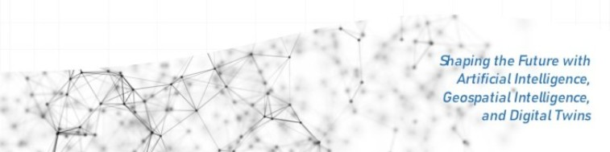

<!-- Profile Banner -->

  

# 👋 Hi, I'm Ange-Morija KOUAMENAN

**Geomatics, AI & BIM Engineer**  
Expert in **Scan-to-BIM**, **Geospatial Data Science**, **Digital Twins**, and **Cloud-Driven 3D Intelligence**

🎓 Graduate of École des Ponts ParisTech, ESTP Paris, BME and UPM.
🏢 Engineer at **QUARTA** | Delivering end-to-end solutions from **point clouds** to **intelligent BIM models** and **real-time spatial insights**

---

## 🧠 Core Expertise

- **Scan-to-BIM** – From laser scans to Revit-based digital models  
- **Geospatial AI** – ML for LiDAR, remote sensing & 3D data  
- **Digital Twins** – 3D/4D modeling for infrastructure and heritage assets  
- **Cloud & Big Data** – Scalable spatial pipelines with AWS & Azure  
- **IoT & Monitoring** – Real-time integration with sensors and dashboards  
- **Cybersecurity** – Secure processing of spatial and 3D data  

---

## 💻 Programming Languages

---

## 🧰 Tools & Platforms

- **3D & Point Cloud**: CloudCompare, Register360, Metashape  
- **Scan-to-BIM Tools**: Revit, AutoCAD, Navisworks, InfraWorks  
- **GIS & Remote Sensing**: QGIS, ArcGIS  
- **Cloud Platforms**:    
- **Monitoring**: Grafana, Docker, PostgreSQL/PostGIS

---

## 🚀 Featured Projects

*(Replace with your real GitHub repositories)*  
- `🏗️ scan2bim-pipeline` – Automated Scan-to-BIM from point cloud to Revit  
- `🛰️ lidar-ai` – ML models for LiDAR segmentation & surface detection  
- `🌐 smart-infra-twin` – Cloud-based monitoring of digital twin models  

---

## 📫 Connect

---

## 📊 GitHub Stats

  

---

> *"From scan to smart model — bridging reality and data-driven design."*
